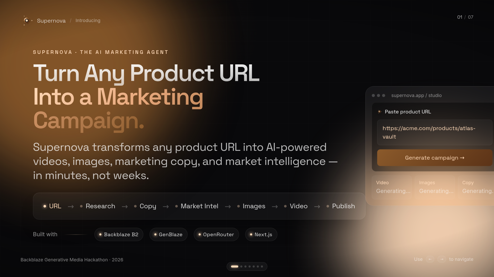

<div align="center">

# 

# Supernova Pitch Deck

**Official Presentation for the Supernova AI Marketing Platform**

_A modern, interactive pitch deck designed for the Backblaze × GenBlaze Hackathon 2026._

<br />


<br />

<!-- GitHub Readme Typing SVG -->
<p align="center">
  
</p>

</div>

---

## 📖 About this Repository

This repository contains the **official pitch deck presentation** used to demonstrate the **Supernova AI Marketing Platform** — an intelligent system that transforms any product URL into complete marketing campaigns.

### What This Presentation Covers

- 🎯 **Problem Statement** — Why marketing automation is broken
- 💡 **Solution Overview** — How Supernova solves it
- 🧠 **AI Workflow** — The GenBlaze orchestration engine
- 📊 **Market Opportunity** — Business potential and impact
- 🏗 **System Architecture** — Technical implementation details
- 🤖 **GenBlaze Integration** — AI model routing and orchestration
- ☁️ **Backblaze B2 Storage** — Durable object storage for campaigns
- 🚀 **Product Demo** — Live platform walkthrough
- 📈 **Future Vision** — Roadmap and expansion plans
- 🏆 **Hackathon Submission** — Competition context and goals

---

## 🎬 Presentation Preview



---

## 🌐 Explore Supernova

| Link | Description |
|------|-------------|
| 🚀 **Main Application** | [https://appsupernova.vercel.app/auth](https://appsupernova.vercel.app/auth) |
| 🌐 **Landing Website** | [https://landing-supernova.vercel.app/](https://landing-supernova.vercel.app/) |
| 🎤 **Live Pitch Deck** | [https://pitch-deck-supernova.vercel.app/](https://pitch-deck-supernova.vercel.app/) |
| 📖 **Engineering Journal** | [https://journal-supernova.vercel.app/](https://journal-supernova.vercel.app/) |
| 🐙 **Main Repository** | [https://github.com/robloxsagax-web/Supernova](https://github.com/robloxsagax-web/Supernova) |

---

## ✨ Presentation Highlights

<div align="center">

| Feature | Description |
|---------|-------------|
| 🎯 **Problem Statement** | Marketing is broken — weeks, thousands of dollars |
| 💡 **Solution Overview** | One URL → Complete marketing campaign in minutes |
| 🧠 **AI Workflow** | GenBlaze orchestrates multiple AI models seamlessly |
| 📊 **Market Opportunity** | $150B+ marketing automation market |
| 🏗 **Architecture** | Scalable Next.js + FastAPI + GenBlaze stack |
| 🤖 **GenBlaze Integration** | Intelligent model routing for best results |
| ☁️ **Backblaze B2 Storage** | Durable, versioned asset storage |
| 🚀 **Product Demo** | Interactive platform walkthrough |
| 📈 **Future Vision** | Multi-modal expansion roadmap |
| 🏆 **Hackathon Submission** | Backblaze × GenBlaze 2026 |

</div>

---

## 🛠 Technology Overview

### Frontend

| Technology | Purpose |
|------------|---------|
| **Next.js** | React framework with SSR |
| **React 19** | Latest React with concurrent features |
| **TypeScript** | Type-safe development |
| **Tailwind CSS** | Utility-first styling |
| **Framer Motion** | Smooth animations |

### Presentation

| Technology | Purpose |
|------------|---------|
| **Interactive Slides** | 7 slides with keyboard navigation |
| **Responsive Scaling** | 1920×1080 canvas adapts to any screen |
| **Modern Motion** | Glassmorphism and glow effects |

### AI & Orchestration

| Technology | Purpose |
|------------|---------|
| **GenBlaze** | AI workflow orchestration engine |
| **OpenRouter** | Multi-model API routing |
| **Claude/GPT/Gemini** | AI models (via OpenRouter) |

### Storage & Deployment

| Technology | Purpose |
|------------|---------|
| **Backblaze B2** | Campaign asset storage |
| **Vercel** | Edge deployment and CDN |

---

## 🎮 How to View

### View Live (Recommended)

Visit the live presentation at: [https://pitch-deck-supernova.vercel.app/](https://pitch-deck-supernova.vercel.app/)

### Keyboard Navigation

| Key | Action |
|-----|--------|
| → / Space | Next slide |
| ← | Previous slide |
| 1-7 | Jump to slide |
| F | Fullscreen mode |
| Home / End | First / Last slide |

### Run Locally

```bash
# Clone the repository
git clone https://github.com/robloxsagax-web/supernova-pitch-deck.git

# Navigate to project
cd supernova-pitch-deck

# Install dependencies
npm install
# or
bun install

# Start development server
npm run dev
```

---

## 📁 Project Structure

```
supernova-pitch-deck/
├── public/
│   ├── favicon.ico
│   ├── favicon.svg
│   ├── logo.png
│   └── pitch-deck.png
├── src/
│   ├── components/
│   │   ├── branding/
│   │   │   ├── SupernovaLogo.tsx
│   │   │   └── index.ts
│   │   ├── slides/
│   │   │   ├── ScaledSlide.tsx
│   │   │   ├── parts.tsx
│   │   │   ├── Slide1Hero.tsx
│   │   │   ├── Slide2Problem.tsx
│   │   │   ├── Slide3How.tsx
│   │   │   ├── Slide4Architecture.tsx
│   │   │   ├── Slide5Why.tsx
│   │   │   ├── Slide6Product.tsx
│   │   │   └── Slide7Closing.tsx
│   │   └── ui/
│   ├── lib/
│   │   ├── utils.ts
│   │   ├── error-capture.ts
│   │   ├── error-page.ts
│   │   └── lovable-error-reporting.ts
│   ├── routes/
│   │   ├── __root.tsx
│   │   ├── index.tsx
│   │   └── README.md
│   ├── router.tsx
│   ├── routeTree.gen.ts
│   ├── server.ts
│   ├── start.ts
│   └── styles.css
├── LICENSE
├── package.json
├── tsconfig.json
├── vite.config.ts
├── components.json
└── README.md
```

---

## 🏆 Built for the AI Hackathon 2026

This repository contains the **official presentation** used to communicate Supernova's vision, architecture, technical implementation, and business impact to hackathon judges.

Supernova demonstrates how AI can transform the marketing industry by:
- Reducing campaign creation time from weeks to minutes
- Automating multi-model AI orchestration
- Providing enterprise-grade storage with Backblaze B2
- Delivering production-ready marketing assets

---

## 🔗 Related Projects

| Project | Description | Live |
|---------|-------------|------|
| Supernova Platform | AI Marketing Platform | [Visit](https://appsupernova.vercel.app/auth) |
| Landing Website | Marketing Site | [Visit](https://landing-supernova.vercel.app/) |
| Engineering Journal | Development Blog | [Visit](https://journal-supernova.vercel.app/) |
| Pitch Deck | Official Presentation | [Visit](https://pitch-deck-supernova.vercel.app/) |

**Main Repository:** [https://github.com/robloxsagax-web/Supernova](https://github.com/robloxsagax-web/Supernova)

---

## 📜 License

This project is licensed under the MIT License — see the [LICENSE](LICENSE) file for details.

---

<div align="center">

## Made with ❤️ for the Backblaze × GenBlaze Hackathon 2026

**Powered by**

[](https://github.com)
[](https://www.backblaze.com/b2/cloud-storage.html)
[](https://nextjs.org/)
[](https://vercel.com)

**Designed and developed by [Muhammad Mujtaba Ismail](https://github.com/robloxsagax-web)**

</div>
